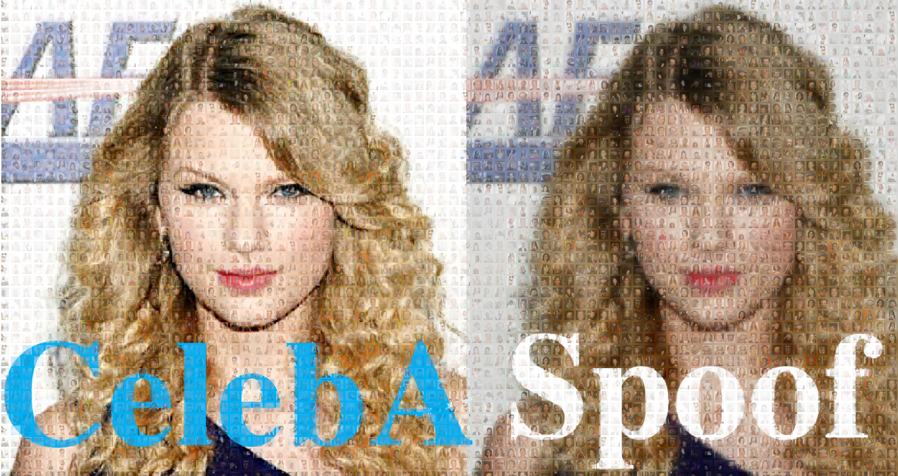
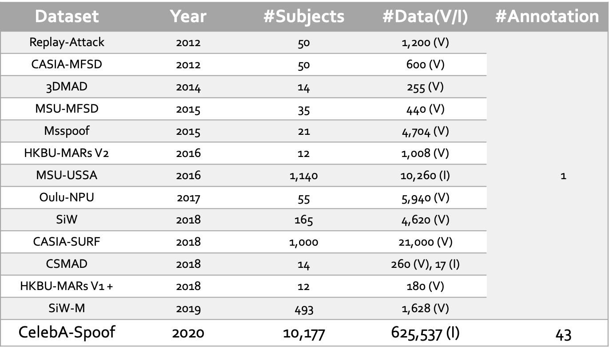

# **CelebA-Spoof: Large-Scale Face Anti-Spoofing Dataset with Rich Annotations**



**CelebA-Spoof: Large-Scale Face Anti-Spoofing Dataset with Rich Annotations**

[Yuanhan Zhang](https://github.com/Davidzhangyuanhan/CelebA-Spoof), [Zhenfie Yin](https://github.com/yinzhenfei), [Yidong Li](http://faculty.bjtu.edu.cn/8408/), [Guojun Yin](https://gjyin91.github.io/), [Junjie Yan](https://yan-junjie.github.io/), [Jing Shao](https://amandajshao.github.io/) and [Ziwei Liu](https://liuziwei7.github.io/)
In ECCV 2020.
[[paper](https://arxiv.org/abs/2007.12342)]

> Abstract: **CelebA-Spoof** is a large-scale face anti-spoofing dataset that has **625,537** images from **10,177** subjects, which includes **43** rich attributes on face, illumination,environment and spoof types. Live image selected from the CelebA dataset. We collect and annotate spoof images of CelebA-Spoof. Among 43 rich attributes, 40 attributes belong to live images including all facial components and accessories such as skin, nose, eyes, eyebrows,  lip, hair, hat, eyeglass. 3 attributes belong to spoof images including spoof types, environments and  illumination conditions.CelebA-Spoof  can be used to **train and evaluate algorithms of face anti-spoofing**.




## Updates

[08/2020] The CelebA-Spoof Challenge 2020 will start together with [ECCV 2020 SenseHuman Workshop](https://sense-human.github.io/).


## Challenge
We host CelebA-Spoof Challenge 2020 based on the CelebA-Spoof dataset. The challenge will officially start together with [ECCV 2020 SenseHuman Workshop](https://sense-human.github.io/). [Registration](https://competitions.codalab.org/competitions/26210#participate) is now open. If you are interested in soliciting new ideas to advance the state of the art in real-world face forgery detection, we look forward to your participation!


## Dataset Downloads

Google Drive and Baidu Drive are available now!

* Google Drive: [downloading link](https://drive.google.com/drive/folders/1OW_1bawO79pRqdVEVmBzp8HSxdSwln_Z?usp=sharing)
* Baidu Drive: [downloading link](https://pan.baidu.com/s/12qe13-jFJ9pE-_E3iSZtkw) (password: 61fd)


## Summary

### Data Collection

We hired $8$ collectors to collect spoof data and another $2$ annotators to refine labeling for all data. To improve the generalization and diversity of the dataset, as shown in Figure below, we define three collection dimensions with fine-grained quantities: 

1. Five Angles: All spoof type need to traverse all five types of angles including ''vertical'',  ''down'',  ''up'',  ''forward'' and ''backward''. The angle of inclination is between [$-30^{\circ}$, $30^{\circ}$].
2. Four Shapes: There are a total of four shapes, ''normal'',  ''inside'', ''outside'' and ''corner''. 
3. Four Sensors: We collected $24$ popular devices with four types, ''PC'', ''camera'', ''tablet'' and ''phone''.


### Rich Annotations

Besides the annotation of live/Spoof, Existing face anti-spoofing only annotate the spoof type. To further comprehensively investigate face anti-spoofing tasks from various perspectives, in CelebA-Spoof, we annotate 43 different annotations. 40 types of Face Attribute defined in CelebA plus 3 attributes of face anti-spoofing, including Spoof Type, Illumination Condition, and Environment.


### AENet

Based on these rich attributes, we further propose a simple yet powerful multi-task framework, namely AENet. Through AENet,we conduct extensive experiments to explore the roles of semantic informationand geometric information in face anti-spoofing.


## Related Works

* **CelebA** dataset:<br/>
Ziwei Liu, Ping Luo, Xiaogang Wang and Xiaoou Tang, "Deep Learning Face Attributes in the Wild", in IEEE International Conference on Computer Vision (ICCV), 2015 

## Dataset Agreement
* The CelebA-Spoof dataset is available for **non-commercial research purposes** only.
* You agree **not to** reproduce, duplicate, copy, sell, trade, resell or exploit for any commercial purposes, any portion of the images and any portion of derived data.
* You agree **not to** further copy, publish or distribute any portion of the CelebA-Spoof dataset. Except, for internal use at a single site within the same organization it is allowed to make copies of the dataset.

## License and Citation
The use of this software is RESTRICTED to **non-commercial research and educational purposes**.
```
@inproceedings{CelebA-Spoof,
  title={CelebA-Spoof: Large-Scale Face Anti-Spoofing Dataset with Rich Annotations},
  author={Zhang, Yuanhan and Yin, Zhenfei and Li, Yidong and Yin, Guojun and Yan, Junjie and Shao, Jing and Liu, Ziwei},
  booktitle={European Conference on Computer Vision (ECCV)},
  year={2020}
}
```
